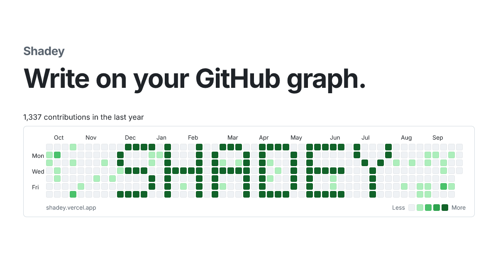
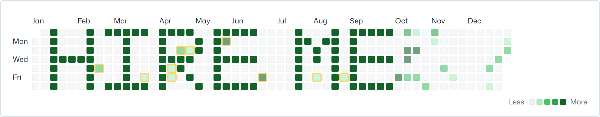
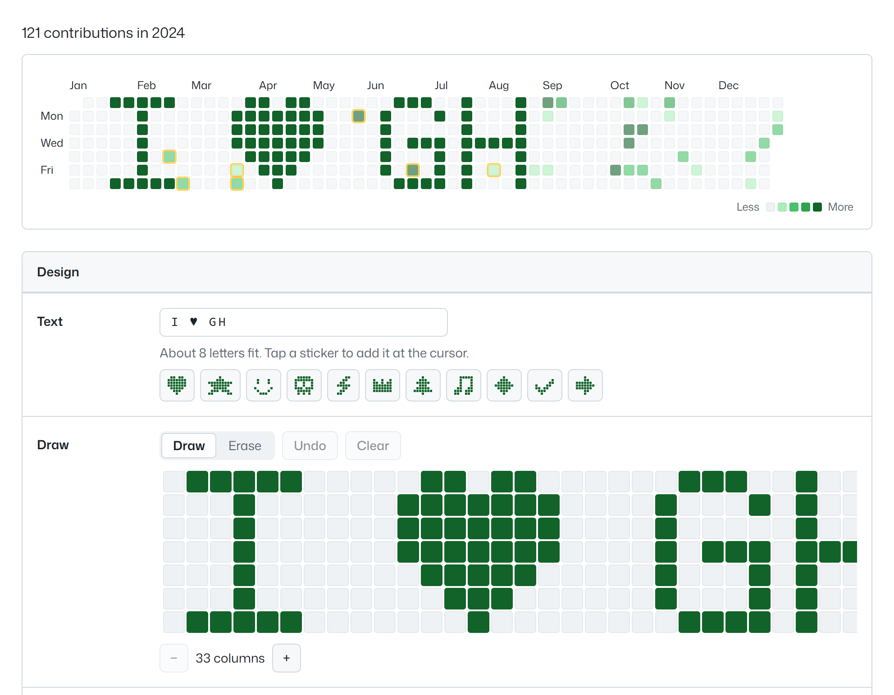

# Shadey

Your contribution graph is the first thing people see on your GitHub profile. Shadey lets you write on it.

Type a word, add a sticker, draw a few squares of your own, see it on your real graph and paint it with one click.

**[Try it at shadey.vercel.app](https://shadey.vercel.app)**

## What it looks like

That's a real graph with HIRE ME painted over it. Your own days stay visible, and the amber outlines mark days where you already had commits, so nothing lands on top of your work by surprise.

## How it works

1. Enter your GitHub username. Shadey shows your graph as it looks today.
2. Type a word, tap a sticker like a heart or a space invader, and fill in squares by hand. The painting appears on your graph as you go.
3. Pick where it goes and how dark it should be. "Find best spot" moves it to the quietest part of your year.
4. Sign in with GitHub and press Paint. Shadey creates one new repo with empty commits dated on the days you painted, and those squares turn green.

## Draw anything

Words, stickers and drawing all go in the same painting, so "I ♥ CODE" with a hand-drawn underline is one design. There are 11 stickers ready to go, including hearts, stars, skulls, crowns and music notes. Heart and star emoji from your phone keyboard work too.

Under the text box sits a grid the same height as your graph. Draw on it to add squares or erase parts of a letter. Change the text afterwards and your drawing stays put. On a phone, one finger draws and two fingers scroll.

## Questions people ask

**Does it touch my other repos?**
No. Shadey makes one new repo per painting and only puts empty commits in it. It never reads or changes your code.

**How do I undo it?**
Delete the repo. GitHub removes those days from your graph, and your graph goes back to how it was. You can also delete paintings from the My paintings page.

**Will the shade come out exactly right?**
Usually. GitHub colors each day relative to your busiest days, so Shadey counts your real commits and works out how many to add. When a day might come out a shade off, it tells you before you paint.

**Why did my painting move?**
The "last 12 months" graph shifts left every week, so a painting there slides off within a year. Paint on a past year instead and it stays.

**Can I keep the repo private?**
Yes. Tick "Private repo". The painting then only shows on your graph if "Private contributions" is turned on in your GitHub profile.

**What does it ask GitHub for?**
Your public profile and permission to create public repos. It asks for more only if you want a private painting.

**Is there a limit?**
Five paintings a day per person.

## Share it

Every painting gets its own page with a preview image, so the link looks good on X, LinkedIn and WhatsApp. You can also download the painting as an image.

## Run your own copy

Setup and deploy steps are in [DEVELOPING.md](DEVELOPING.md).
